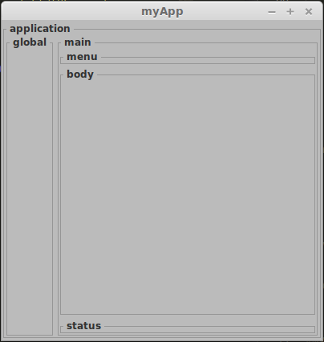

Applicazione Base
=================

Oggi vedremo una struttura di una applicazione base.

In pratica creiamo un template di contenitori per separare le varie aree dove andremo successivamente ad inserire i nostri **widgets**.

.. code-block:: python

	"""                                                    
	"conf                                       .------------------------.
	"0001 - aBox            (h application)     | application            |
	"0002   - gBox            (h global)        |   .--------------------.
	"0004   - mBox            (v main)          |   | g | m | menu       |
	"0008     - uBox            (h menu)        |   | l | a .------------.
	"0010     - bBox            (v body)        |   | o | i | body       |
	"0020     - sBox            (h status)      |   | b | n |            |
	"                                           |   | a |   .------------.
	"                                           |   | l |   | status     |
	"                                           .---.---.----------------.
	"""	

.. more::

myApp 
=====

Esempio

.. literalinclude:: myApp.py
    :language: python

**links:**

	* :download:`my00init </_static/20150822/my00init.py>`
	* :download:`myWind </_static/20150822/myWind.py>`
	* :download:`myApp </_static/20150822/myApp.py>`

Come potete vedere ho preferito riscrivere l' intera classe invece di derivarla da **MyWind**. 

Mywind è servita, nel precedente post, solo come esempio di utilizzo.

**MyApp** cerca di suddividere le aree di inserimento per creare un framework omogeneo. 

* **Application** e' il contenitore di tutta la struttura.
* **Global** contiene la struttura principale dove risiedono il menù, il corpo e la barra di stato. 

Serve a inserire, in futuro dei **widgets** sul lato Dx della nostra applicazione.

Gli altri contenitori si commentano da soli.

Nei parametri di inizializzazione è presente **conf** che serve a poter decidere quali contenitori devono essere presenti sulla nostra applicazione. E' un flag che di default abilita tutti i contenitori. 

.. code-block:: python

	if conf == 0x003f: # all
		self.xBox = myBox1("v")
		self.add(self.xBox)
		# insert object in application (app, glo, mai, men, bod, sta)
		self.xBox.pack_start(child=aObj, expand=True, fill=True, padding=padd) # 0001
		self.aBox.pack_start(child=gObj, expand=expa, fill=fill, padding=padd) # 0002
		self.aBox.pack_start(child=mObj, expand=True, fill=True, padding=padd) # 0004
		self.mBox.pack_start(child=uObj, expand=expa, fill=fill, padding=padd) # 0008
		self.mBox.pack_start(child=bObj, expand=True, fill=True, padding=padd) # 0010
		self.mBox.pack_start(child=sObj, expand=expa, fill=fill, padding=padd) # 0020

L'introduzione di questo parametro mi è risultato utile solo in alcuni casi eccezionali dove dovevo recuperare spazio ed estetica.

**myApp**

Se proviamo ad avviare lo script **myApp.py** vediamo la nostra applicazione.

Come potete notare dalla figura della nostra applicazione lo spazio occupato dai contenitori **global** e **body** e' espanso per tutta l' area possibile. Per raggiungere questo scopo bisogna impostare gli attributi **expand** e **fill** con il valore **True**.

Vi suggerisco di giocare un pò con questi attributi per comprendere meglio il loro funzionamento.

Saluti
------

Nel prossimo post inizieremo a creare il nostro primo package per organizzare il nostro codice ad affrontare lo sviluppo dei nostri **widgets** futuri.

Ciao alla prossima. (stay tune!)

.. author:: default
.. categories:: none
.. tags:: none
.. comments::
