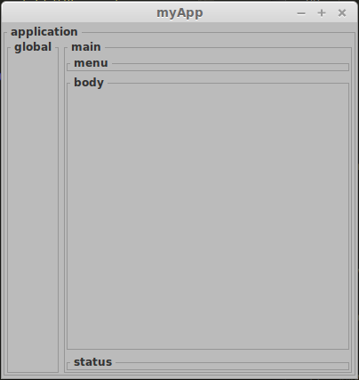

Package
=======

Oggi vedremo come strutturare il nostro prima **package**.

In pratica dobbiamo creare una directory a cui assegneremo il nome **myWidg** ed inserire al suo interno i nostri files.

.. more::

 Inseriamo i seguenti files già scaricati.

* **my00init.py**
* **myWind.py**
* **myApp.py**

Inoltre creiamo un file vuoto **__init__.py** che indica a python di gestire questa directory come un **package**. 

Bene torniamo su di un livello e copiamo anche qui **my00init.py**

Modifichiamo solo questo file in modo da attivare il caricamento delle nostre librerie nella root di lavoro.

.. code-block:: python

	if 1:
		insLib(myRoot+'/myWidg',True)

Creiamo la nostra applicazione di partenza.

**l01_startGtk.py**

.. literalinclude:: /_static/20150823/l01_startGtk.py
    :language: python

Come potete vedere dal codice non c' è nulla di nuovo ma è servito solo come esercizio per capire come usare il **package** *myWidg*.

Quello che è cambiato è il modo di importare i nostri moduli.

.. code-block:: python

	#-----------------------------------------------------------------------------
	from my00init import *

	#-----------------------------------------------------------------------------
	from myApp import MyApp

Alla fine dovremo ritrovarci con la seguente struttura:

.. code-block:: rest

	l01_startGtk.py
	my00init.py
	myWidg/
	  __init__.py
	  my00init.py
	  myWind.py
	  myApp.py

**links:** 

	:download:`l01_startGtk </_static/20150823/l01_startGtk.py>`
	:download:`my00init </_static/20150823/my00init.py>`
	:download:`myWidg__init__ </_static/20150823/myWidg/__init__.py>`
	:download:`my00init </_static/20150823/myWidg/my00init.py>`
	:download:`myWind </_static/20150823/myWidg/myWind.py>`
	:download:`myApp </_static/20150823/myWidg/myApp.py>`

.. warning:: Durante il download, non sono riuscito a capire il motivo, i nomi potrebbero cambiare. Dovete rinominarli come da struttura sopra!

Se proviamo ad avviare lo script **l01_startGtk.py** rivediamo la nostra applicazione.

Saluti
------

Nel prossimo post inizieremo a creare il template dei contenitori.

Ciao alla prossima. (stay tune!)

.. author:: default
.. categories:: none
.. tags:: none
.. comments::
