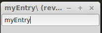
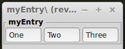
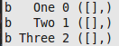
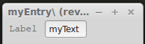
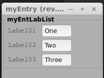
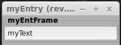
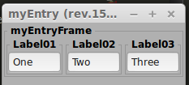

myEntry
=======

Il widget **Entry** serve per permettere all' utente di passare in ingresso un valore che può essere successivamente convertito in qualsiasi tipo. Esempio: stringa, numero intero, numero float, ecc.

.. more::

myEntry
-------

Interessante notare l' attributo **numb** che ci permette di decidere il numero di caratteri che saranno visibili nella nostra **Entry**.

.. literalinclude:: /_static/20150828/myWidg/my02Entry.py
    :language: python
    :lines: 25-76

L'evento usato in questo caso si chiama **on_activate** e ce ne serviamo per raccogliere i dati scritti quando l' utente preme il **CR** (Carrige Return).

.. literalinclude:: /_static/20150828/myWidg/my02Entry.py
    :language: python
    :lines: 38-39

Da notare che possiamo passare dei dati che possono essere elaborati dalla nostra **callback**. Durante il test viene fatto un esempio. Inoltre viene ridefinita la **callback** per dimostrare la grande flessibilità di questo modo di operare.

.. literalinclude:: /_static/20150828/myWidg/my02Entry.py
    :language: python
    :lines: 67-69

Se proviamo ad avviare il **test** otterremo quanto segue.

	*testEntry in esecuzione*. Guardare il risultato sul terminale da cui si è avviato lo script.

myEntList
---------

Come sempre aggiungiamo la nostra lista che ci sarà utile più avanti.

.. literalinclude:: /_static/20150828/myWidg/my02Entry.py
    :language: python
    :lines: 77-125

Unica cosa da notare nella callback delle entry list abbiamo un parametro in più **ind** che ci permetterà di risalire a quale oggetto appartiene l' evento generato.

.. literalinclude:: /_static/20150828/myWidg/my02Entry.py
    :language: python
    :lines: 84-87

Se proviamo ad avviare il **test** otterremo quanto segue.

	*testEntList in esecuzione*. Se guardate il risultato nel solito terminale vedrete che se provate a generare i 3 eventi sulle 3 entry vi restituiscono l 'indice per ogni evento che vi sarà utile a risalire a quale entry appartengono i dati restituiti.

	*uscita* dal terminale.

myEntLabel
----------

Per dare una identificazione ad ogni singola **entry** possiamo aggiungere una **label** al suo fianco

.. literalinclude:: /_static/20150828/myWidg/my02Entry.py
    :language: python
    :lines: 127-181

Il codice è molto simile a **myEntry** con l' aggiunta degli attributi della **label** aggiuntiva.

Se proviamo ad avviare il **test** otterremo quanto segue.

	*testEntLable in esecuzione*.

myEntLabList
------------

Sarò ripetitivo ma aggiungiamo la nostra solita lista.

.. literalinclude:: /_static/20150828/myWidg/my02Entry.py
    :language: python
    :lines: 183-236

Se proviamo ad avviare il **test** otterremo quanto segue.

	*testEntLabList in esecuzione*.

myEntFrame
----------

Per dare una identificazione ad ogni singola **entry** possiamo anche ricorrere ad un **frame**.

.. literalinclude:: /_static/20150828/myWidg/my02Entry.py
    :language: python
    :lines: 238-284

Il codice cambia solo per gli attributi associati al **frame**.

Se proviamo ad avviare il **test** otterremo quanto segue.

	*testEntFrame in esecuzione*.

myEntFraList
------------

Per dare una identificazione ad ogni singola **entry** possiamo anche ricorrere ad un **frame**.

.. literalinclude:: /_static/20150828/myWidg/my02Entry.py
    :language: python
    :lines: 286-343

Se proviamo ad avviare il **test** otterremo quanto segue.

	*testEntFraList in esecuzione*.

Package
-------

La struttura aggiornata del nostro package è la seguente:

.. code-block:: rest

	l00_start.py
	l01_startGtk.py
	my00init.py
	myWidg/
	  __init__.py
	  my00init.py
	  my00initGtk.py
	  my01Box.py
	  my02Label.py
	  my02Entry.py
	  myWind.py
	  myApp.py

Per scaricare la nuova versione :download:`20150828.zip </_static/20150828.zip>`

Saluti
------

Bene anche questo post è finito. Spero di esservi stato utile.

Nel prossimo post vedremo gli oggetti **txtView**.

Ciao alla prossima. (stay tune!)

.. author:: default
.. categories:: programming
.. tags:: programming, python, gtk
.. comments::
