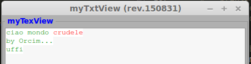

myTextView
==========

Il widget **myTxtView** serve a visualizzare il contenuto del widget **TextBuffer** che memorizza del testo con attributi associati. In altre parole la base di un editor di testo.

.. more::

myTxtView
---------

Oltre ai soliti attributi come dimensioni, tipo caratteri, viene istanziato il **TextBuffer** che è la base del nostro **TextView** e anche **myScrolled** che vedremo dopo.

.. literalinclude:: /_static/20150831/myWidg/my02TxtView.py
    :language: python
    :lines: 60-173

Notate che nell'istanza del **TextBuffer** definiamo dei **tags** che altro non sono degli attributi che possiamo associare a delle aree del buffer. In questo caso servono a cambiare i colori di fondo e del testo. 

.. literalinclude:: /_static/20150831/myWidg/my02TxtView.py
    :language: python
    :lines: 107-114

Interessante notare le **callbacks** definite che ci aiuteranno nelle operazioni di

*Pulisci il buffer*

.. literalinclude:: /_static/20150831/myWidg/my02TxtView.py
    :language: python
    :lines: 121-124

*Leggi il buffer*

.. literalinclude:: /_static/20150831/myWidg/my02TxtView.py
    :language: python
    :lines: 126-129

*Scrivi nel buffer*

.. literalinclude:: /_static/20150831/myWidg/my02TxtView.py
    :language: python
    :lines: 130-134

*Scrivi nel buffer assegnando il tag*

.. literalinclude:: /_static/20150831/myWidg/my02TxtView.py
    :language: python
    :lines: 135-138

testTxtView
-----------

Come possiamo vedere dal test la cosa importante e' dare una referenza agli oggetti che ritorna la nostra istanza. 

.. literalinclude:: /_static/20150831/myWidg/my02TxtView.py
    :language: python
    :lines: 175-214

Solo quelli che vogliamo usare successivamente.

.. literalinclude:: /_static/20150831/myWidg/my02TxtView.py
    :language: python
    :lines: 187-192

Se proviamo ad avviare il **test** otterremo quanto segue.

	*testTxtView in esecuzione*. 

timeout
-------

Per arricchire il nostro test ho voluto inserire un pezzo di codice che viene molto utile quando si vuol eseguire qualche metodo in modo differito.

.. literalinclude:: /_static/20150831/myWidg/my02TxtView.py
    :language: python
    :lines: 208-211

myScrolled
----------

.. literalinclude:: /_static/20150831/myWidg/my02TxtView.py
    :language: python
    :lines: 22-58

Questo è un oggetto per semplicare l'istanza e l'applicazione delle barre di scorrimento. Potete notare la sua applicazione nel codice precedente in **myTxView**. Funge da contenitore!

Package
-------

La struttura aggiornata del nostro package è la seguente:

.. code-block:: rest

	l00_start.py
	l01_startGtk.py
	my00init.py
	myWidg/
	  __init__.py
	  my00init.py
	  my00initGtk.py
	  my01Box.py
	  my02Label.py
	  my02Entry.py
	  my02TxtView.py
	  myWind.py
	  myApp.py

Per scaricare la nuova versione :download:`20150831.zip </_static/20150831.zip>`

Saluti
------

Bene anche questo post è finito. 

Nel prossimo post vedremo gli oggetti **button**.

Ciao alla prossima. (stay tune!)

.. author:: default
.. categories:: programming
.. tags:: programming, python, gtk
.. comments::
