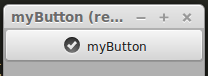
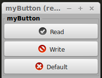
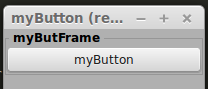

myButton
========

Il modulo **my03Button** contiene una serie di widgets per la gestione del **button** tradizione.

.. more::

myButton
---------

Come nella **entry** passiamo oltre **icon** che definisce il tipo di icona che vogliamo usare la callback **call** per definire la funzione che vogliamo usare.  Questa viene richiamata quando l'utente prema il pulsante. Il nome dell' *evento* è il solito **clicked**.

.. literalinclude:: /_static/20150901/myWidg/my03Button.py
    :language: python
    :lines: 25-57

testButton
----------

Come possiamo vedere dal codice del **test** se vogliamo visualizzare l' icona, che di default rimane nascosta, dobbiamo abilitarla tramite apposita istruzione.

.. literalinclude:: /_static/20150901/myWidg/my03Button.py
    :language: python
    :lines: 58-71

Se proviamo ad avviare il **test** otterremo quanto segue.

	*testButton* in esecuzione. 

myButList
---------

Come al solito segue il metodo delle liste che ci torna utile nel caso dobbiamo definire una serie di pulsanti omogenei.

.. literalinclude:: /_static/20150901/myWidg/my03Button.py
    :language: python
    :lines: 73-98

testButList
-----------

Anche qui ho aggiunto del codice di esempio. In questo caso vediamo come poter cambiare l' icona già assegnata di default.

.. literalinclude:: /_static/20150901/myWidg/my03Button.py
    :language: python
    :lines: 99-125

La lista delle icone predefinite la potete trovare al seguente link: `icons <http://www.pygtk.org/pygtk2reference/gtk-stock-items.html>`_

Se proviamo ad avviare il **test** otterremo quanto segue.

	*testButList* in esecuzione. 

myButFrame
----------

A volte è utile enfatizzare l' area dove si trova un pulsante. Per questo usiamo il **frame**.

.. literalinclude:: /_static/20150901/myWidg/my03Button.py
    :language: python
    :lines: 127-171

testButFrame
------------

.. literalinclude:: /_static/20150901/myWidg/my03Button.py
    :language: python
    :lines: 172-186

Se proviamo ad avviare il **test** notiamo i 2 nomi diversi assegnati.

	*testButFrame* in esecuzione. 

myButFraList
------------

La solita lista di oggetti. 

.. literalinclude:: /_static/20150901/myWidg/my03Button.py
    :language: python
    :lines: 188-217

testButFraList
--------------

Il codice di esempio. 

.. literalinclude:: /_static/20150901/myWidg/my03Button.py
    :language: python
    :lines: 218-244

Se proviamo ad avviare il **test** otterremo quanto segue.

.. figure:: testButFraList.png
	:align: center
	:alt: alternate text

	*testButFraList* in esecuzione. 

Package
-------

La struttura aggiornata del nostro package è la seguente:

.. code-block:: rest

	l00_start.py
	l01_startGtk.py
	my00init.py
	myWidg/
	  __init__.py
	  my00init.py
	  my00initGtk.py
	  my01Box.py
	  my02Label.py
	  my02Entry.py
	  my02TxtView.py
	  my03Button.py
	  myWind.py
	  myApp.py

Per scaricare la nuova versione :download:`20150901.zip </_static/20150901.zip>`

Saluti
------

Per oggi mi fermo qui. 

Nel prossimo post vedremo alcune varianti del **button**.

Ciao alla prossima. (stay tune!)

.. author:: default
.. categories:: programming
.. tags:: programming, python, gtk
.. comments::
