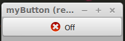
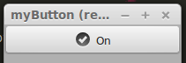
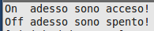
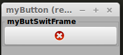

myButton (il seguito)
=====================

Continuiamo con la descrizione, del modulo **myButton**, iniziata nel precedente post.

.. more::

myButSwitch
-----------

Il **button switch** è una variante del nostro **button** tradizione. 

.. literalinclude:: /_static/20150902/myWidg/my03Button.py
    :language: python
    :lines: 246-312

Abbiamo modificato gli attributi passati durante l' istanza. La maggior parte di questi sono diventati delle liste per poter essere ripresi in base allo stato dell' oggetto stesso. 

Come potete notare dal codice sopra, usiamo la **callback** per poter alternare al volo la **label** dell' oggetto stesso.

testButSwitch
-------------

Il codice del **test**, come sempre, aiuta in futuro a fare un **copia** e **incolla** da riportare nel nostro codice di sviluppo per partire da una base senza doversi ogni volta ricordare come poterlo sfruttare.

.. literalinclude:: /_static/20150902/myWidg/my03Button.py
    :language: python
    :lines: 314-329

Se proviamo ad avviare il **test** otterremo quanto segue.

	*testButSwitch Off* in esecuzione. 

Dopo un click sul pulsante vedremo come segue.

	*testButSwitch On* in esecuzione. 

Se abbiamo avviato il nostro script da **terminale** possiamo leggere come segue.

	lettura nel *terminale*. 

myButSwiFrame
-------------

Il **button switch frame** è una **button switch** inserito in un **frame** che però non ha **label** nel pulsante. 

.. literalinclude:: /_static/20150902/myWidg/my03Button.py
    :language: python
    :lines: 331-401

testButSwiFrame
---------------

Di seguito il codice per il test del nostro widget.

.. literalinclude:: /_static/20150902/myWidg/my03Button.py
    :language: python
    :lines: 403-421

Se proviamo ad avviare il **test** otterremo quanto segue.

	*testButSwiFrame* in esecuzione. 

Package
-------

La struttura aggiornata del nostro package è la seguente:

.. code-block:: rest

	l00_start.py
	l01_startGtk.py
	my00init.py
	myWidg/
	  __init__.py
	  my00init.py
	  my00initGtk.py
	  my01Box.py
	  my02Label.py
	  my02Entry.py
	  my02TxtView.py
	  my03Button.py
	  myWind.py
	  myApp.py

Per scaricare la nuova versione :download:`20150902.zip </_static/20150902.zip>`

Saluti
------

Nel prossimo post vedremo il widget **button check**.

Ciao alla prossima. (stay tune!)

.. author:: default
.. categories:: programming
.. tags:: programming, python, gtk
.. comments::
