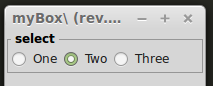

myRadioButton
=============

Il widget **radio button** viene usato quando si ha la necessità di selezionare uno degli N valori presenti. Un numero intero indica la selezione.

.. more::

myRadButton
-----------

Per dover di cronaca il widget **myRadButton** come definito qui sotto a poco senso, visto che ha una sola scelta. L' ho fatto per mantenere una certa omogeneità nelle definizioni rispetto agli altri oggetti.

.. literalinclude:: /_static/20150904/myWidg/my03RadButton.py
	:language: python
	:lines: 24-60

myRadButList
------------

Questo è il primo **widget** utile di questo modulo. L' attributo **valu** durante l' istanza definisce quale bottone deve essere selezionato. Il valore 0 indica il primo oggetto, 1 il secondo e così di seguito.

.. literalinclude:: /_static/20150904/myWidg/my03RadButton.py
	:language: python
	:lines: 86-124

testRadButList
--------------

.. literalinclude:: /_static/20150904/myWidg/my03RadButton.py
	:language: python
	:lines: 126-147

Se proviamo ad avviare il **test** vedremo:

	*testRadButList* in esecuzione. 

myRadButLisLabel
----------------

Come per i **check buttons** anche qui ho realizzato la stessa lista ma con una **label** in testa che può tornare utile in alcune situazioni

.. literalinclude:: /_static/20150904/myWidg/my03RadButton.py
	:language: python
	:lines: 149-206

testRadButLisLabel
------------------

.. literalinclude:: /_static/20150904/myWidg/my03RadButton.py
	:language: python
	:lines: 208-230

Se proviamo ad avviare il **test** vediamo:

.. figure:: testRadButLisLabel.png
	:align: center
	:alt: alternate text

	*testRadButLisLabel* in esecuzione. 

.. note:: Vi invito per lo studio dei nostri **widgets** di avviari gli scripts sempre da terminale. Così potete visualizzare i messaggi in uscita fatti ad hoc per i nostri test.  

Package
-------

La struttura aggiornata del nostro package è la seguente:

.. code-block:: rest

	l00_start.py
	l01_startGtk.py
	my00init.py
	myWidg/
	  __init__.py
	  my00init.py
	  my00initGtk.py
	  my01Box.py
	  my02Label.py
	  my02Entry.py
	  my02TxtView.py
	  my03Button.py
	  my03RadButton.py
	  myWind.py
	  myApp.py

Per scaricare la nuova versione :download:`20150904.zip </_static/20150904.zip>`

Saluti
------

Per oggi mi fermo qui. 

Nel prossimo post vedremo **la nostra prima applicazione reale**.

Ciao alla prossima. (stay tune!)

.. author:: default
.. categories:: programming
.. tags:: programming, python, gtk
.. comments::
