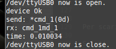

myProtocol
==========

Oltre al modulo di **trasporto** che abbiamo visto nel precedente post, per fare una buona comunicazione abbiamo bisogno di definire il nostro **protocollo**. Il protocollo stabilisce le regole di come si formattano, incapsulano, i dati. 

.. more::

Le cose basilari sono come riconoscere l' **inizio** e la **fine** del nostro pacchetto completo di dati.

Si perchè lo start/stop **hardware** definisce l' inizio e la fine della trasmissione fisica non quella dell' intero pacchetto dati. In altre parole noi potremmo ricevere dati in tempi diversi e solo al riconoscimento del fine pacchetto processeremo i nostri dati.

Il riconoscimento dei dati si fa attraverso una funzione chiamata in inglese **parser** in italiano il termine si traduce in **analizzatore**.

Protocollo
----------

Nelle comunicazioni seriali si può decidere di trasmettere i dati in binario o in chiaro tramite la codifica **Ascii**. 

In questo ultimo caso, se non abbiamo necessità particolari, basta riconoscere solo il fine del pacchetto. 

Con la codifica **Ascii** il modo più semplice per determinare il fine pacchetto è usare il fine linea **LF** (Line Feed) o/e il ritorno carrello **CR** (Carriage Return).

Un esempio più complesso di protocollo potrebbe essere il seguente:

.. literalinclude:: /_static/20150906/myAppSerial/myLib/myProtocol/myProtocol.py
	:language: python
	:lines: 8-27

MyProtocol
----------

Il nostro protocollo prevederà la gestione di ricezione dati sia binaria che ascii.

.. literalinclude:: /_static/20150906/myAppSerial/myLib/myProtocol/myProtocol.py
	:language: python
	:lines: 44-228

Iniziamo con commentare gli **attributi** di istanza.

	* **ser** 	passa l' istanza del device se definito
	* **sta** 	definisce quale sarà la stringa/carattere che identificherà in nostro **start** protocol
	* **sto** 	definisce quale sarà la lista dei caratteri che identificherà in nostro **stop** protocol
	* **hex** 	abilita visualizzazione dati in formato esadecimale
	* **cal** 	l' istanza del **parser** da usare

Il codice seguente viene utile in caso si voglia simulare un device.

.. literalinclude:: /_static/20150906/myAppSerial/myLib/myProtocol/myProtocol.py
	:language: python
	:lines: 85-95

Notare che la **callback** deve tornare sempre un **True** se si vuole mantenerla attiva nel loop di **idle**.

.. literalinclude:: /_static/20150906/myAppSerial/myLib/myProtocol/myProtocol.py
	:language: python
	:lines: 134-136

.. literalinclude:: /_static/20150906/myAppSerial/myLib/myProtocol/myProtocol.py
	:language: python
	:lines: 168-169

.. literalinclude:: /_static/20150906/myAppSerial/myLib/myProtocol/myProtocol.py
	:language: python
	:lines: 202-206

MyParser
--------

Il parser puo' essere fatto con un **metodo** o con una **classe** dipende dalle esigenze del caso. In questo caso è una classe.

.. literalinclude:: /_static/20150906/myAppSerial/myLib/myProtocol/myProtocol.py
	:language: python
	:lines: 230-244

In questo caso non fa nulla, semplicemente si limita a visualizzare quello che riceve.

myTry01
-------

La nostra prova si limita a istanziare un seriale, un protocollo e un parser.

.. literalinclude:: /_static/20150906/myAppSerial/myLib/myProtocol/myProtocol.py
	:language: python
	:lines: 249-276

Il rimanente codice di test invece è presente nel nostro **main**

.. literalinclude:: /_static/20150906/myAppSerial/myLib/myProtocol/myProtocol.py
	:language: python
	:lines: 295-298

Qui inviamo una stringa. E attendiamo la sua ricezione entro un certo tempo. 

	Ricordate di fare il loop hardware nel vostro **device**.

Come avrete notato usa un metodo **myTimeOut** che è stato aggiunto sul modulo **my00init.py**. Questa è una **utility** per avviare un metodo passandogli eventuali parametri e richiedendo che venga concluso entro un certo tempo. Torna il tempo trascorso della sua esecuzione.

Se proviamo ad avviare il **test** da terminale **$ python myProtocol.py** vedremo:

	*myProtocol* in esecuzione. 

Notiamo che nei dati che riceve il **parser** non è presente lo **start** del protocollo. Mentre è presento lo **stop** che serve ad indicare al parser il fine lavoro.

Package
-------

La struttura aggiornata del nostro package è la seguente:

.. code-block:: rest

	myAppSerial/
	  l00_start.py
	  l01_startGtk.py
	  my00init.py
	  myLib/
	    __init__.py
	    myProtocol/
	      __init__.py
	      my00init.py
	      mySerial.py
	      myProtocol.py

Per scaricare la nuova versione :download:`20150906.zip </_static/20150906.zip>`

Saluti
------

Per oggi mi fermo qui. 

Nel prossimo post vedremo inizieremo a vedere **GUI** il lato grafico.

Ciao alla prossima. (stay tune!)

.. author:: default
.. categories:: programming
.. tags:: programming, python, gtk
.. comments::
